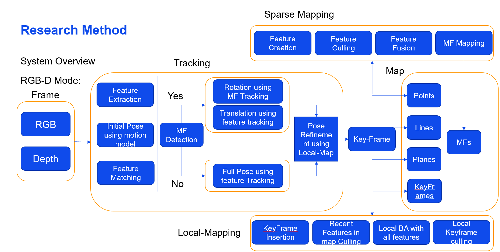
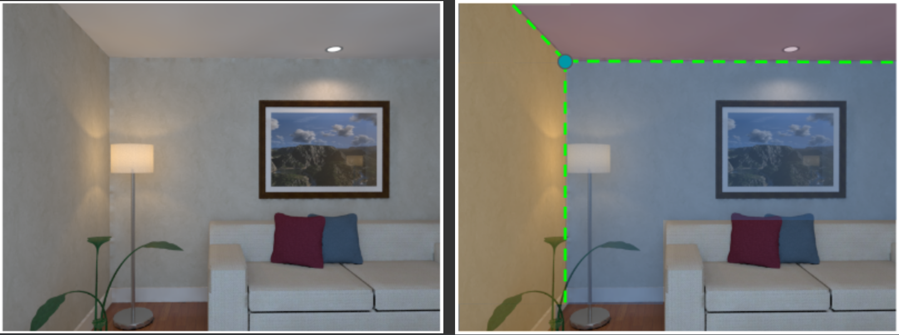
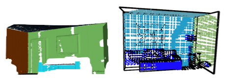
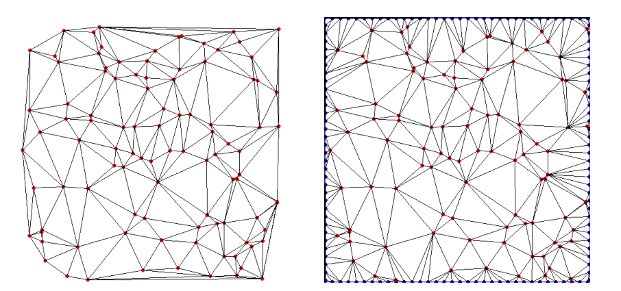
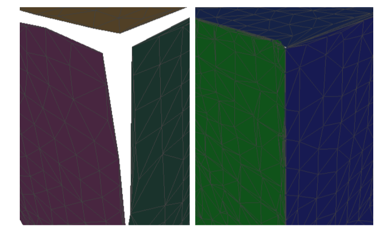

# iTAM 
iTAM is a versatile tracking and mapping system, which estimates camera poses and generates a completed map of indoor scenes based on RGB-D sequences.
# Abstract
Indoor environments often appear in augmented/virtual reality applications and can be divided into planar and non-planar areas. Plane areas are often used to build floors, walls, ceilings and furniture surfaces, they occupy a large area but are easy to parameterize. However, non-planar regions, which are important for reconstruction quality, are difficult to represent with a fixed parameterization.
To reconstruct a lightweight and complete dense model, this system proposes a hybrid dense reconstruction method based on RGB-D sensors. First, the non-planar regions are reconstructed using the TSDF method and fitted by the Marching-Cube algorithm. Then, the planar regions are constructed directly using the 2D delaunay triangulation method. In addition, in order to solve the problem of holes caused by the aliasing effect of the boundary of the plane area and the occlusion of objects, this poster adopts two other steps. On the one hand, the intersections between intersecting planes are computed, discretized into points and merged into the relevant planes. On the other hand, we complete the holes caused by occlusion based on the ray casting algorithm.
To improve the accuracy of the pose estimation, we adopt the method from the [Manhattan-SLAM](https://github.com/razayunus/ManhattanSLAM) and the [Planar-SLAM](https://github.com/yanyan-li/PlanarSLAM).

# System Overview



# Experiment Result



Left image: origin image, right image: detected cross lines between different layouts.



Left image: Triangle mesh without completion, Right image: Sparse map with real-time ray-casting completion.



Left image: Original triangle mesh plane, Right image: Triangle mesh plane with boundary completion



Left Image: Wall reconstruction with traditional triangle mesh. Right: Our iTAM Reconstruction method.

# 1.Prerequisites

We have tested the library in **16.04**, but it should be easy to compile in other platforms. A powerful computer (e.g. i7) will ensure real-time performance and provide more stable and accurate results.

## C++11 or C++0x Compiler
We use the new thread and chrono functionalities of C++11.

## Pangolin
We use [Pangolin](https://github.com/stevenlovegrove/Pangolin) for visualization and user interface. Dowload and install instructions can be found at: https://github.com/stevenlovegrove/Pangolin.

## PCL
We use [PCL](http://www.pointclouds.org/) to reconstruct and visualize mesh. Download and install instructions can be found at: https://github.com/ros-perception/perception_pcl. **Tested with PCL 1.7.0**.

## OpenCV
We use [OpenCV](http://opencv.org) to manipulate images and features. Dowload and install instructions can be found at: http://opencv.org. **Required at leat 2.4.3. Tested with OpenCV 2.4.11 and OpenCV 3.2**.

## Eigen3
Required by g2o (see below). Download and install instructions can be found at: http://eigen.tuxfamily.org. **Required at least 3.1.0**.

## DBoW2 and g2o (Included in Thirdparty folder)
We use modified versions of the [DBoW2](https://github.com/dorian3d/DBoW2) library to perform place recognition and [g2o](https://github.com/RainerKuemmerle/g2o) library to perform non-linear optimizations. Both modified libraries (which are BSD) are included in the *Thirdparty* folder.

# 2. Test the system

1. compile 

   ```
   ./build.sh
   ```

2. testing command

   ```
   ./Examples/RGB-D/rgbd_tum    Vocabulary/ORBvoc.txt  Examples/RGB-D/TUM3.yaml ../../../research/PublicDataset/rgbd_dataset_freiburg3_structure_texture_far ../../../research/PublicDataset/rgbd_dataset_freiburg3_structure_texture_far/association.txt
   
   ```
